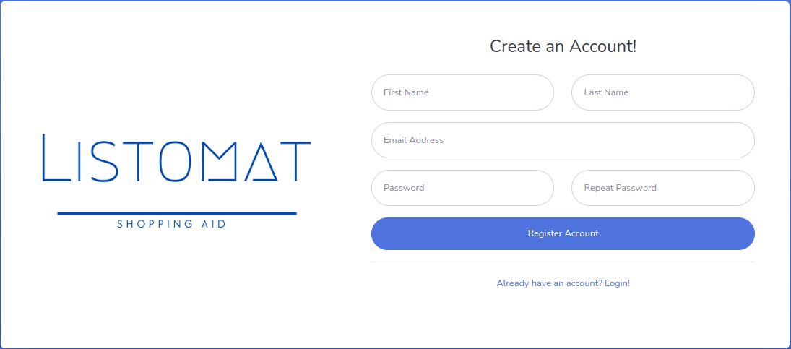
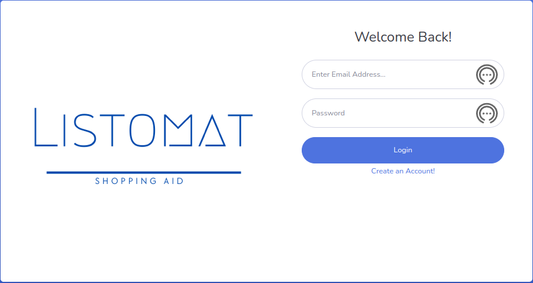
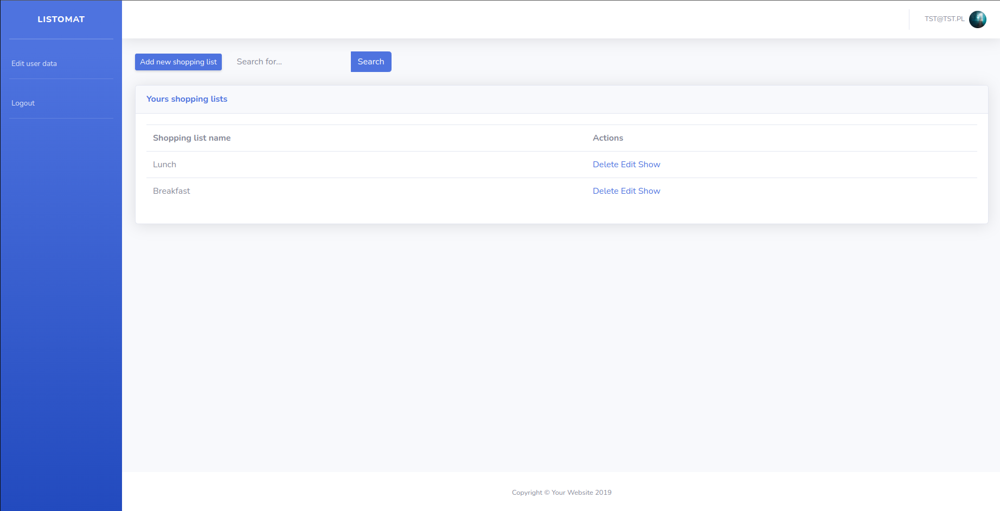
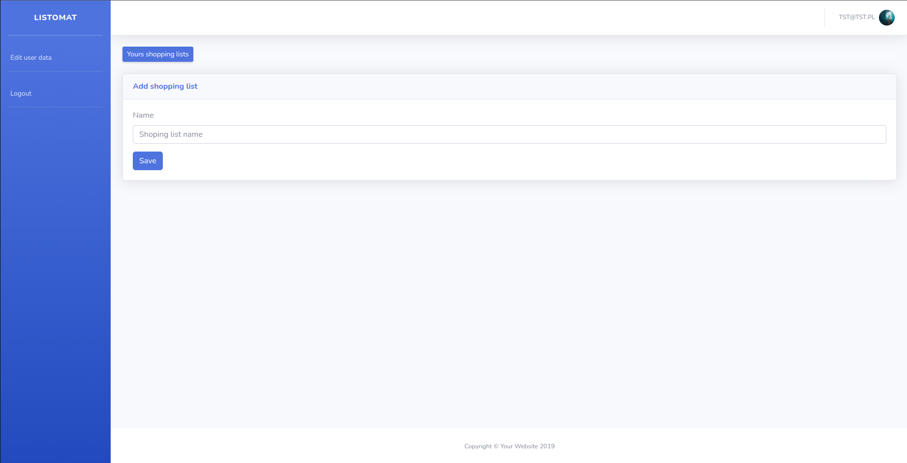
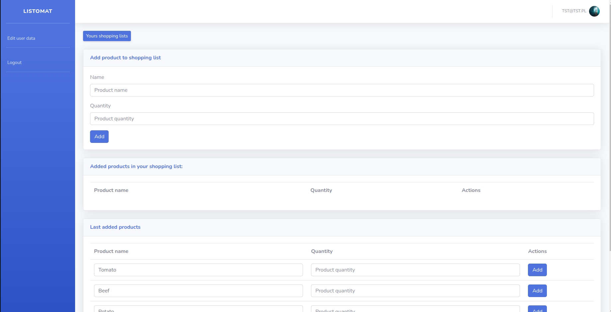
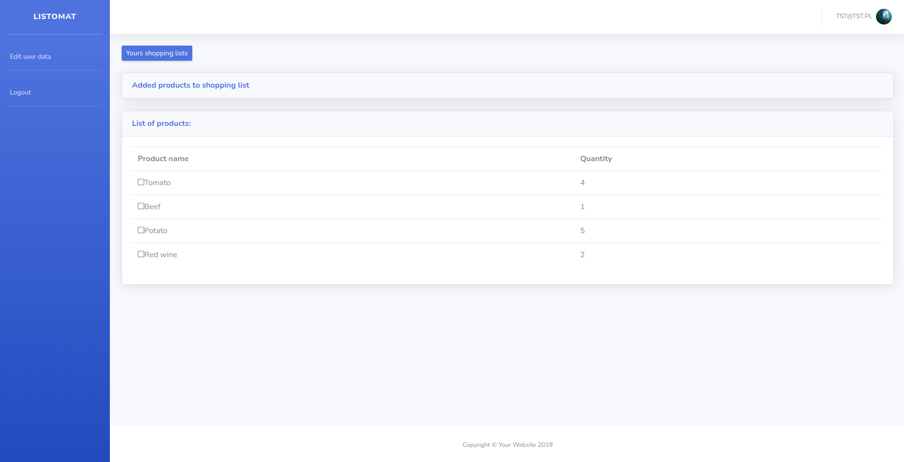
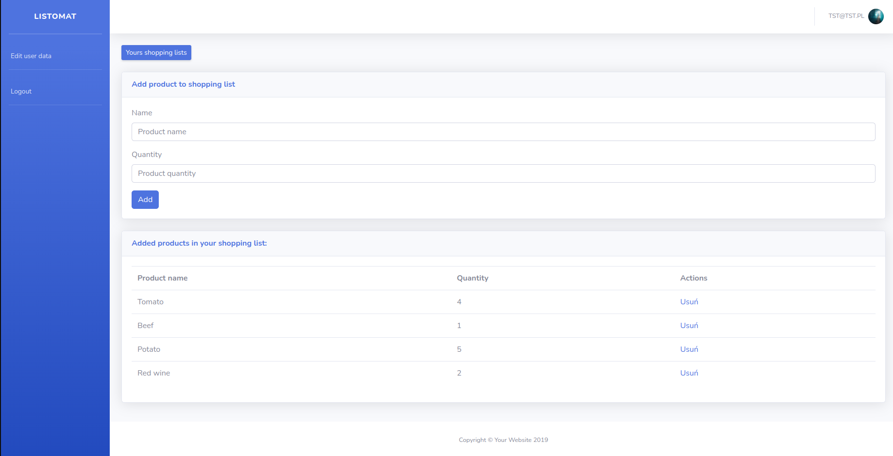

# Listomat

## What is Listomat?

Listomat is an application for creating and managing shopping lists. After creating an account and logging in
the user can create a shopping list and add products to it. The user can also search
previously created lists and edit them. When the list is no longer needed, it can be deleted.

## Technologies
* Java EE
* Spring
* Hibernate
* JSTL and JSP in front
* mysql
* lombok
* jbcrypt
* Tomcat

## How to start?

1. Create a [*fork*](https://guides.github.com/activities/forking/) repository with tasks.
2. Clone the repository to your computer. Use the command for that `git clone repository_address`. 
3. You can find the address of the repository on the repository page after pressing the button "Clone or download". 
4. Note that to use your own fork address, it should look like this:
`https://github.com/your-login/repository_address`

3. Remember to create a database called listomatdb. If your database authorization details are different,
   you also need to make the appropriate correction.

4. To create the connection, we will use the Tomcat servlet container, useful links below:
   * How to Install Tomcat on Linux: https://www.digitalocean.com/community/tutorials/install-tomcat-on-linux
   * How to add Apache Tomcat to your application: https://www.jetbrains.com/idea/guide/tutorials/working-with-apache-tomcat/using-existing-application/

## User flow:
### 1 - Register page

### 2 - Login page

### 3 - Home page

### 4 - Add shopping list page

### 5 - Add product to shopping list page

### 6 - Added products to shopping list page

### 7 - Edit shopping list page

