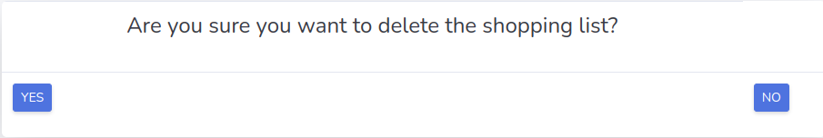
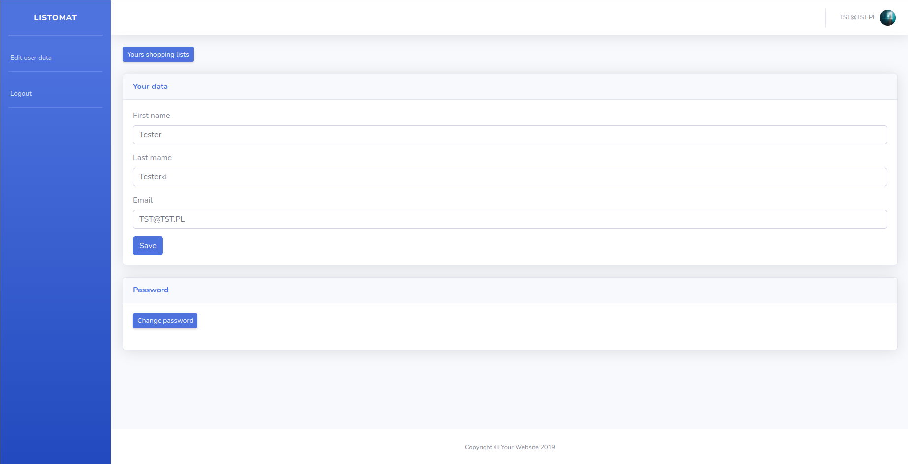
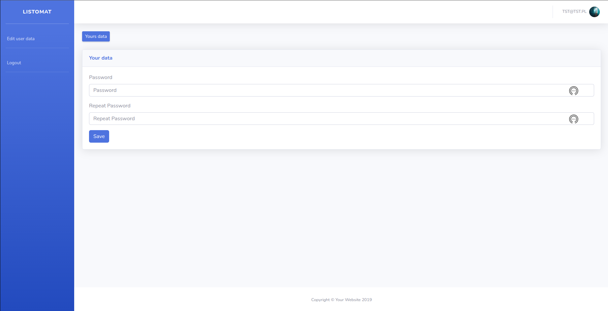

# Listomat

## What is Listomat?

Listomat is an application for creating and managing shopping lists. After creating an account and logging in
the user can create a shopping list and add products to it. The user can also search
previously created lists and edit them. When the list is no longer needed, it can be deleted.

## Technologies
* Java EE
* Spring
* Hibernate
* JSTL and JSP in front
* mysql
* lombok
* jbcrypt
* Tomcat

## How to start?

1. Create a [*fork*](https://guides.github.com/activities/forking/) repository with tasks.
2. Clone the repository to your computer. Use the command for that `git clone repository_address`. 
3. You can find the address of the repository on the repository page after pressing the button "Clone or download". 
4. Note that to use your own fork address, it should look like this:
`https://github.com/your-login/repository_address`

3. Remember to create a database called listomatdb. If your database authorization details are different,
   you also need to make the appropriate correction.

4. To create the connection, we will use the Tomcat servlet container, useful links below:
   * How to Install Tomcat on Linux: https://www.digitalocean.com/community/tutorials/install-tomcat-on-linux
   * How to add Apache Tomcat to your application: https://www.jetbrains.com/idea/guide/tutorials/working-with-apache-tomcat/using-existing-application/

## User flow:
### 1 - Register page

You can create an account from this page. Enter your name, surname, email address and password, which you must confirm. 
The registration form has validation of all fields.

If the indicated e-mail address is already used, you can move to the login form.

### 2 - Login page

There are two validated fields in the form: e-mail address and password. 
It is possible to move to the registration form if you do not have an account.

### 3 - Home page

After logging in, the user sees a list of entered lists sorted from the last one added. 
In addition, it is possible to create a new list, edit user data and log out.

In addition, from this page, the user can:
- edit the list;
- show products from the list;
- delete the list

### 4 - Add shopping list page

After selecting the option to add a new list, the user can enter the name of the list and proceed to adding products.

### 5 - Add product to shopping list page

You can add product lists after the list of usernames. This can be done in two ways:
1. To obtain the product and quantity in parts of the site;
2. Select a product from the list of products that you later added to another list.

### 6 - Added products to shopping list page

By selecting the show option on the home page, 
the user can see all the products added to the list and mark them with a checkbox.

### 7 - Edit shopping list page

By selecting the edit option, the user can add new products to the list and remove existing ones from it.

### 8 - Delete list

By selecting the delete options, the user deletes the list. Then the user will be asked if he is sure to delete the list. Selecting "NO" will take you to the home page. 
Selecting "YES" will take you to the home page and the list will be deleted.

### 9 - Edit user

By selecting the edit user data option, the user can edit his data. After going to the editing window, two sections are visible:
1. Editing name, surname and e-mail address;
2. Button transferring to the password edition form.

### 10 - Edit password

By selecting the change password option, the user can change his password. To do this, he must enter a new password and repeat it.

